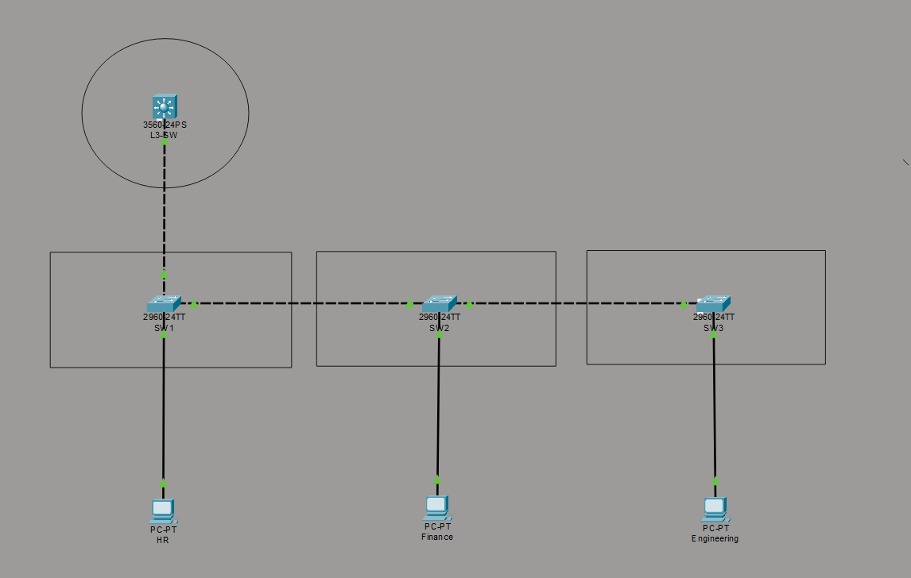
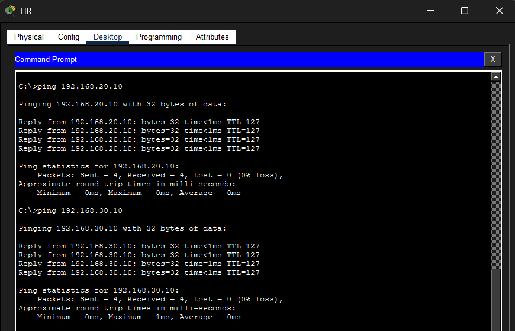
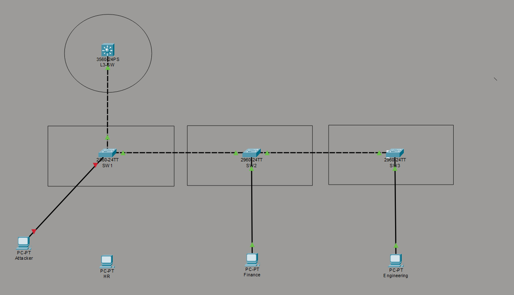
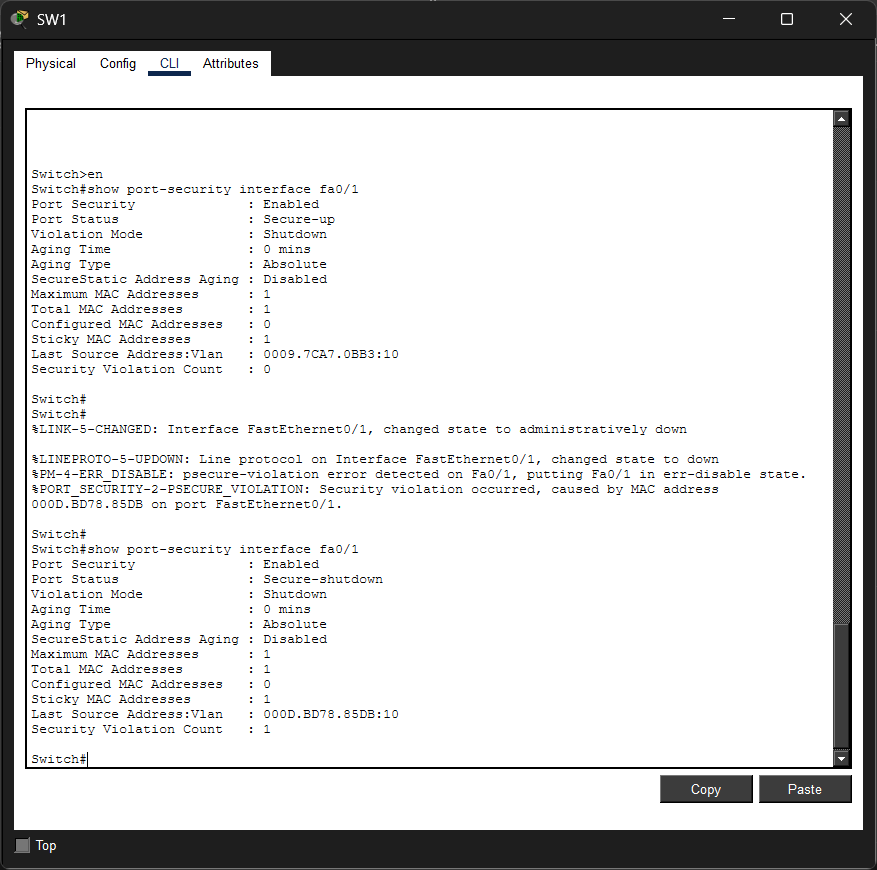

# Enterprise VLAN Architecture with Inter-VLAN Routing & Layer 2 Security

## Executive Summary

This project implements a segmented enterprise LAN using VLANs, controlled inter-VLAN routing, and Layer 2 access security. The design isolates departmental traffic (HR, Finance, Engineering) while maintaining controlled communication through a centralized Layer 3 switch.

The system was validated through connectivity testing, failure simulation, and security enforcement scenarios.

---

## Topology

---

## Skills Demonstrated

- VLAN Segmentation (Layer 2 Isolation)
- 802.1Q Trunking
- Inter-VLAN Routing using SVIs
- Layer 2 Security (Port Security)
- Network Failure Simulation & Troubleshooting
- Traffic Flow Analysis

---

## Network Addressing

| Device        | VLAN | IP Address     | Gateway        |
|--------------|------|---------------|----------------|
| HR PC        | 10   | 192.168.10.10 | 192.168.10.1   |
| Finance PC   | 20   | 192.168.20.10 | 192.168.20.1   |
| Engineering  | 30   | 192.168.30.10 | 192.168.30.1   |
| Attacker PC  | 10   | 192.168.10.50 | 192.168.10.1   |

---

## Architecture Overview

- Access Layer: SW1, SW2, SW3 (End-device connectivity)
- Distribution/Core Layer: L3-SW (Routing + Control Plane)

Each department is mapped to a dedicated VLAN and subnet:

- VLAN 10 → HR → 192.168.10.0/24
- VLAN 20 → Finance → 192.168.20.0/24
- VLAN 30 → Engineering → 192.168.30.0/24

---

## Design Decisions

### VLAN Segmentation

Departments are isolated at Layer 2 to reduce broadcast domains and improve security boundaries.

### Layer 3 Switch (SVI Routing)

A Layer 3 switch was selected over router-on-a-stick to eliminate bottlenecks and provide wire-speed routing.

### Controlled Trunking

Trunk links are restricted to VLANs 10, 20, 30 only, reducing unnecessary traffic propagation.

### Port Security Enforcement

Access ports are locked to a single MAC using sticky learning. Any violation results in immediate shutdown (err-disabled).

---

## Packet Flow Analysis

Example: HR → Finance communication

1. HR sends traffic to default gateway (192.168.10.1)
2. Frame enters SW1 tagged as VLAN 10
3. Traffic traverses trunk to L3-SW
4. L3-SW routes from VLAN 10 → VLAN 20
5. Packet exits toward SW2 tagged as VLAN 20
6. Delivered to Finance endpoint

This demonstrates integration of Layer 2 forwarding with Layer 3 routing.

---

## Connectivity Verification

### Inter-VLAN Communication

- HR → Finance → SUCCESS  
- HR → Engineering → SUCCESS  
- Finance → Engineering → SUCCESS  

---

## Security Test — Port Security Violation

To validate Layer 2 security, an unauthorized device (Attacker PC) was connected to an access port configured with port-security.

### Attack Scenario

- Original device MAC was learned via sticky MAC
- Attacker device introduced a new MAC address
- Switch detected violation immediately

### Result

- Interface Fa0/1 transitioned to **err-disabled state**
- Port status changed from `secure-up` → `secure-shutdown`
- Unauthorized access was blocked

### Verification (CLI Output)

- Port Status : Secure-shutdown
- Violation Mode : Shutdown
- Security Violation Count : 1

### Attack Topology

The attacker device was connected to a secured access port on SW1.

### Evidence (Violation Triggered)

### Key Takeaway

This demonstrates protection against:

- Unauthorized device access  
- Rogue endpoints  
- MAC-based attacks  

Port security ensures only trusted devices can communicate within the network.

---

## Failure Testing & Observations

### Trunk Link Failure

- Disconnecting trunk caused loss of inter-switch communication  
- Highlighted dependency on backbone connectivity  

### VLAN Pruning Failure

- Removing VLAN 20 from trunk isolated Finance network  
- Other VLANs remained unaffected  

### Native VLAN Mismatch

- Generated CDP warnings  
- Demonstrated misconfiguration detection and potential security risks  

---

## Verification Commands

- VLAN status → `show vlan brief`  
- Trunk status → `show interfaces trunk`  
- Routing interfaces → `show ip interface brief`  
- Port security → `show port-security interface`  

---

## Results

- VLAN segmentation successfully enforced  
- Inter-VLAN routing operational via L3 switch  
- Trunk links carrying controlled VLAN traffic  
- Unauthorized access blocked using port security  
- Failure scenarios reproduced and analyzed  

---

## Scalability & Improvements

- Add DHCP for automated IP assignment  
- Implement ACLs for traffic filtering  
- Introduce STP tuning and redundancy  
- Extend to multi-site architecture  

---

## Tools Used

- Cisco Packet Tracer  
- Cisco IOS CLI  

---

## Author

Hrishikesh Kanapuram
