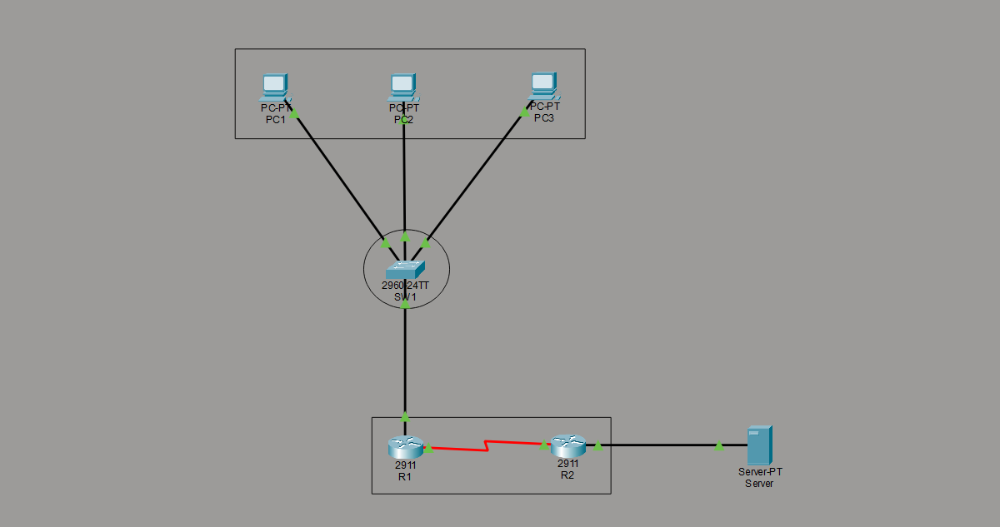

# NAT, DHCP & Internet Gateway Simulation

### Enterprise Edge Network Design with Failure Analysis

---

## Overview

This project simulates a real-world enterprise edge network where a private LAN accesses the internet through a gateway router using DHCP and NAT (PAT).

The design replicates how organizations connect internal users to external networks while maintaining address translation, routing control, and network isolation.

Beyond basic setup, this project includes **failure scenario testing and root cause analysis**, demonstrating practical troubleshooting skills used in production environments.

---

## Architecture

* **LAN Network:** 192.168.1.0/24
* **Gateway Router (R1):**

  * Provides DHCP
  * Performs NAT/PAT
  * Acts as default gateway
* **ISP Router (R2):**

  * Simulates upstream provider
  * Maintains return path
* **Internet Simulation:**

  * Server network (8.8.8.0/24)

---

## Topology

Refer to:



---

## Key Concepts Implemented

* DHCP (Dynamic Host Configuration Protocol)
* NAT Overload (PAT — Port Address Translation)
* Default Routing (Gateway of Last Resort)
* ACL-based NAT Control
* WAN Link Configuration
* End-to-End Packet Flow Validation

---

## Configuration

### R1 — Edge Gateway Router

* LAN interface configuration
* DHCP server setup
* NAT (PAT overload) configuration
* Default route to ISP

Refer: `configs/R1.txt`

---

### R2 — ISP Simulation Router

* WAN interface configuration
* Internet network hosting
* Static route for return traffic

Refer: `configs/R2.txt`

---

## Verification

The network was validated under normal operating conditions.

### DHCP Verification

* Clients receive IP automatically
* Correct gateway and DNS assigned

### Connectivity Verification

* LAN → Gateway (R1) ✔
* LAN → ISP (R2) ✔
* LAN → Internet (8.8.8.8) ✔

### NAT Verification

* Private IPs translated to public IP
* Translation table populated
* Multiple sessions handled via PAT

### Routing Verification

* Default route configured on R1
* Return route configured on R2
* Bidirectional communication achieved

Refer:

* `verification/baseline.md`
* `verification/nat.md`
* `verification/routing.md`

---

## Failure Testing & Troubleshooting

A key focus of this project is **controlled failure simulation and analysis**.

Each scenario demonstrates how specific misconfigurations impact network behavior.

---

### Test 1 — NAT Failure

* Cause: NAT disabled on LAN interface
* Result: Internet fails, LAN works
* Insight: Translation required for private networks

---

### Test 2 — Routing Failure

* Cause: Default route removed
* Result: Destination unreachable
* Insight: Routing decision required before forwarding

---

### Test 3 — ACL Blocking NAT

* Cause: ACL denies LAN traffic
* Result: Silent NAT failure
* Insight: Policy can block translation without obvious errors

---

### Test 4 — WAN Link Failure

* Cause: Interface shutdown
* Result: Full external connectivity loss
* Insight: Physical layer failures override all configurations

---

Refer:

* `failure-tests/test1-nat-break.md`
* `failure-tests/test2-route-break.md`
* `failure-tests/test3-acl-break.md`
* `failure-tests/test4-wan-break.md`

---

## Packet Flow (Conceptual)

```
PC (192.168.1.x)
→ R1 (NAT translates to 203.0.113.1)
→ R2 (ISP)
→ Server (8.8.8.8)

Return Path:
Server → R2 → R1 → PC
```

---

## Key Learnings

* NAT depends on proper routing to function
* Routing must exist in both forward and return paths
* ACLs can silently break NAT without visible errors
* Physical layer failures override logical configurations
* Structured troubleshooting (Layer-by-Layer) is critical

---

## Real-World Relevance

This setup directly reflects:

* Home routers performing NAT for internet access
* Enterprise edge devices handling outbound traffic
* ISP customer edge configurations
* Network troubleshooting workflows used in production

---

## Project Value

This project demonstrates:

* Network design fundamentals
* Configuration accuracy
* Failure simulation capability
* Root cause analysis
* Structured troubleshooting approach

---

## Author

Hrishikesh Kanapuram
