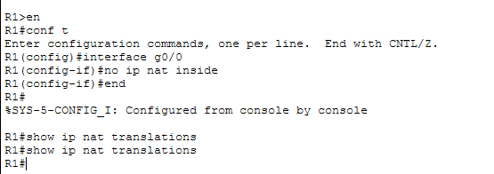

# Test 1 — NAT Failure

## Objective

Validate behavior when NAT translation is disabled on the gateway router.

---

## Break Configuration

**Device: R1**

```bash
interface g0/0
no ip nat inside
```

---

## Expected Behavior

* LAN communication should work
* Internet access should fail

---

## Observed Results

### Before

* `ping 8.8.8.8` → Success

### After

* `ping 8.8.8.8` → Failed (timeout)
* `ping 192.168.1.1` → Success

---

## NAT Verification

```bash
show ip nat translations
```

* Output: **Empty**

---

## Root Cause

NAT was disabled on the inside interface, preventing private IP addresses from being translated into a public IP. As a result, return traffic from the external network could not reach the internal hosts.

---

## Fix

```bash
interface g0/0
ip nat inside
```

---

## Result After Fix

* Internet access restored
* NAT translations visible again

---

## Screenshots



