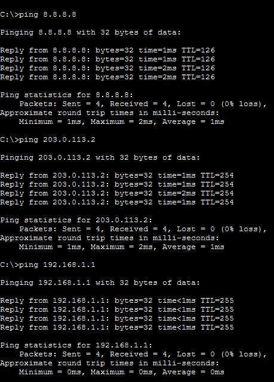
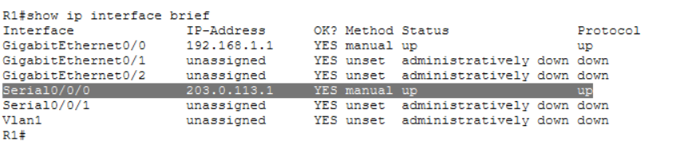

# Baseline Verification

## Objective

Verify that the network is fully operational with end-to-end connectivity from LAN to Internet.

---

## DHCP Verification (PC)

* Device: PC3
* Command:

```
ipconfig
```


* Result:

  * IPv4 Address: 192.168.1.13
  * Subnet Mask: 255.255.255.0
  * Default Gateway: 192.168.1.1

* Conclusion:

  * DHCP is working correctly and assigning valid IP configuration.

---

## Connectivity Tests (PC)

### 1. Ping Gateway (R1)

```
ping 192.168.1.1
```

Result:

* Success (0% loss)

---

### 2. Ping ISP Router (R2)

```
ping 203.0.113.2
```

Result:

* Success (0% loss)

---

### 3. Ping Internet Server

```
ping 8.8.8.8
```


Result:

* Success (0% loss)

---

## Interface Status (R1)

* Command:

```
show ip interface brief
```


* Key Observations:

  * GigabitEthernet0/0 → up/up (LAN)
  * Serial0/0/0 → up/up (WAN)

---

## Conclusion

* DHCP working ✔
* LAN connectivity working ✔
* WAN connectivity working ✔
* Internet access working ✔

System is fully operational.
