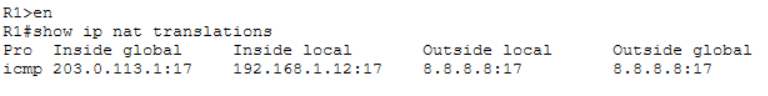
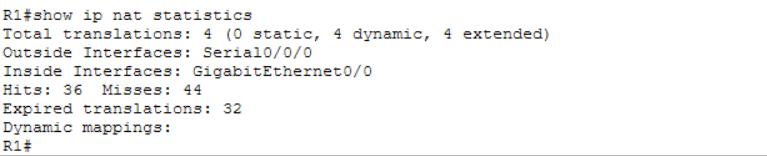

# NAT Verification

## Objective

Verify that private IP addresses are being translated to public IP using NAT (PAT).

---

## Traffic Generation (PC)

* Command:

```
ping 8.8.8.8
```

* Result:

  * Successful replies received

---

## NAT Translation Table (R1)

* Command:

```
show ip nat translations
```


* Sample Entry:

```
icmp 203.0.113.1:17 192.168.1.12:17 8.8.8.8:17 8.8.8.8:17
```

### Interpretation

* Inside Local → 192.168.1.12 (private IP)
* Inside Global → 203.0.113.1 (public IP)

This confirms NAT translation is occurring.

---

## NAT Statistics (R1)

* Command:

```
show ip nat statistics
```


* Key Metrics:

  * Total translations: 4
  * Hits: increasing
  * Inside Interface: GigabitEthernet0/0
  * Outside Interface: Serial0/0/0

---

## Conclusion

* NAT is active and functioning ✔
* Private IPs are successfully translated to public IP ✔
* PAT (overload) is handling multiple sessions ✔
