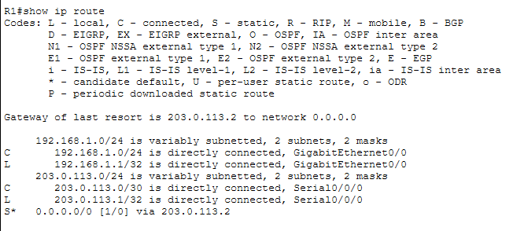
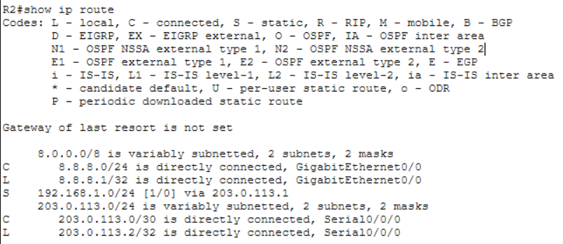

# Routing Verification

## Objective

Verify correct routing configuration on both gateway (R1) and ISP router (R2).

---

## R1 Routing Table

* Command:

```
show ip route
```


### Observations

* Connected Routes:

  * 192.168.1.0/24 → LAN
  * 203.0.113.0/30 → WAN

* Default Route:

```
S* 0.0.0.0/0 via 203.0.113.2
```

### Interpretation

* R1 forwards unknown traffic (internet-bound) to R2.

---

## R2 Routing Table

* Command:

```
show ip route
```


### Observations

* Connected:

  * 203.0.113.0/30 → WAN
  * 8.8.8.0/24 → Server network

* Static Route:

```
192.168.1.0/24 via 203.0.113.1
```

### Interpretation

* R2 knows how to return traffic back to LAN.

---

## End-to-End Routing Flow

```
PC → R1 → R2 → Server (8.8.8.8)
```

Return path:

```
Server → R2 → R1 → PC
```

---

## Conclusion

* Forward path routing ✔
* Return path routing ✔
* Default route correctly configured ✔

Full bidirectional routing achieved.
