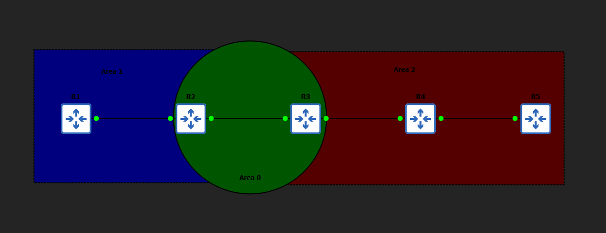
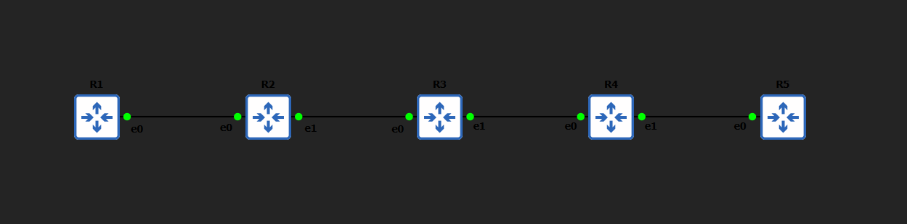

# Multi-Area OSPF Implementation & Failure Testing (GNS3)

## Overview

This project implements a **multi-area OSPF network** in GNS3 and validates its behavior under real-world failure conditions.

It focuses on how OSPF operates in production environments — including routing hierarchy, convergence, failure handling, and scalability mechanisms.

**Designed and tested with production-like failure scenarios to validate real-world OSPF behavior.**

---

## Architecture

### Area Design

* **Area 1**: R1, R2
* **Area 0 (Backbone)**: R2, R3
* **Area 2**: R3, R4, R5

### Router Roles

* **R2** → ABR (Area 1 ↔ Area 0)
* **R3** → ABR (Area 0 ↔ Area 2)
* **R1, R5** → Edge routers
* **R4** → Transit router

---

## Design Highlights

* Hierarchical OSPF architecture for scalability
* Backbone-centric routing (strict Area 0 dependency)
* Route summarization at ABRs:

  * `10.1.0.0/16` (Area 1)
  * `10.2.0.0/16` (Area 2)
* Point-to-point network types for deterministic adjacency

---

## Topology

### Logical Design (OSPF Areas)



### Physical Topology (Interface Layout)



---

## IP Addressing

### Point-to-Point Links

| Link  | Network      |
| ----- | ------------ |
| R1–R2 | 10.0.12.0/30 |
| R2–R3 | 10.0.23.0/30 |
| R3–R4 | 10.0.34.0/30 |
| R4–R5 | 10.0.45.0/30 |

### Loopback Networks

| Router | Network     |
| ------ | ----------- |
| R1     | 10.1.1.1/24 |
| R2     | 10.1.2.1/24 |
| R3     | 10.2.3.1/24 |
| R4     | 10.2.4.1/24 |
| R5     | 10.2.5.1/24 |

---

## Core Concepts Demonstrated

### Multi-Area OSPF

* Logical segmentation of network domains
* Reduced LSA flooding
* Improved scalability

### Area Border Routers (ABRs)

* Control route exchange between areas
* Perform summarization to optimize routing tables

### Route Summarization

* Aggregates multiple networks into a single prefix
* Reduces routing table size and LSA overhead
* Improves convergence performance

### OSPF Convergence

* Automatic recalculation on topology change
* Dynamic route installation and withdrawal

### OSPF Process ID Behavior

* Process ID is locally significant
* Does not impact neighbor adjacency

---

## Failure Testing Methodology

Each test is structured to reflect real-world troubleshooting workflow:

```
Baseline → Failure Injection → Impact → Recovery → Verification
```

---

## Failure Scenarios

### 1. Backbone Failure (Area 0 Dependency)

* Link broken: R2–R3
* Result: Inter-area routing fails
* Insight: All inter-area traffic must traverse Area 0

---

### 2. Route Summarization Removal

* Action: Disabled `area range` on ABRs
* Result: Routing table expands with specific routes
* Insight: Summarization is critical for scalability

---

### 3. Area Mismatch

* Action: Incorrect OSPF area on interface
* Result: Adjacency failure
* Insight: Area ID must match for neighbor formation

---

### 4. Link Failure (Physical Outage)

* Action: Shutdown R3–R4 link
* Result: Network partition, route withdrawal
* Insight: OSPF reacts instantly to interface state changes

---

### 5. OSPF Process ID Change

* Action: Changed process ID on R2
* Result: Adjacency still forms
* Insight: Process ID is locally significant only

---

## Verification Commands

```
show ip route ospf
show ip ospf neighbor
show running-config | section ospf
ping <destination>
```

---

## Key Learnings

* Area 0 is mandatory for inter-area communication
* ABRs are critical control points in OSPF design
* Route summarization directly impacts scalability
* OSPF dynamically adapts to failures with fast convergence
* Misconfigurations (area mismatch, link failure) have immediate impact
* Process ID does not influence adjacency

---

## Outcome

This project demonstrates:

* Strong understanding of OSPF architecture and design
* Hands-on implementation of multi-area routing
* Ability to simulate and analyze network failures
* Practical troubleshooting and validation skills

---

## Author

Hrishikesh Kanapuram

