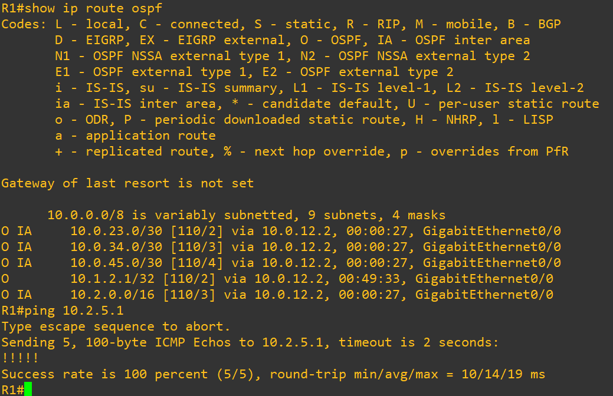
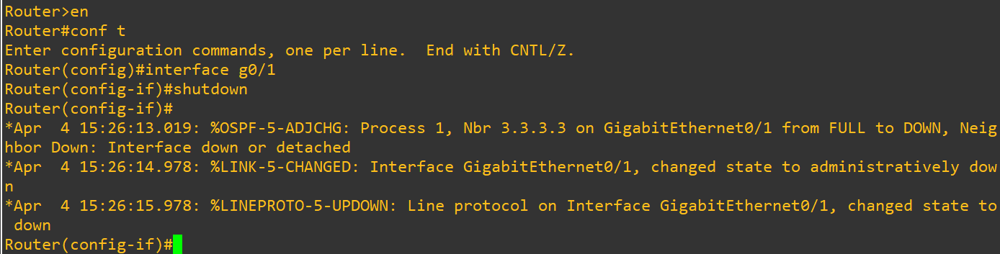
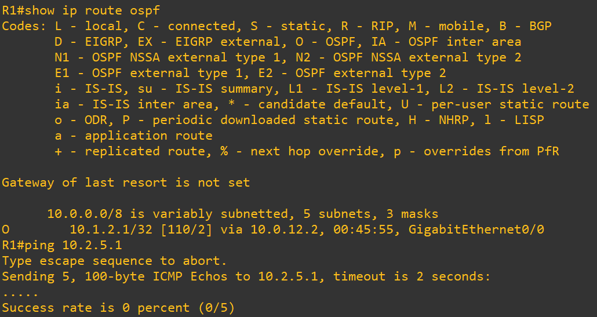
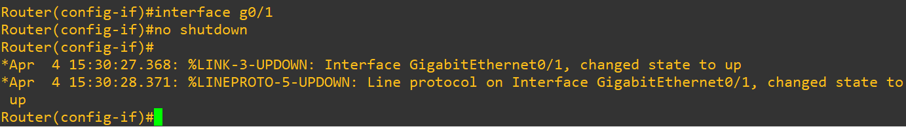
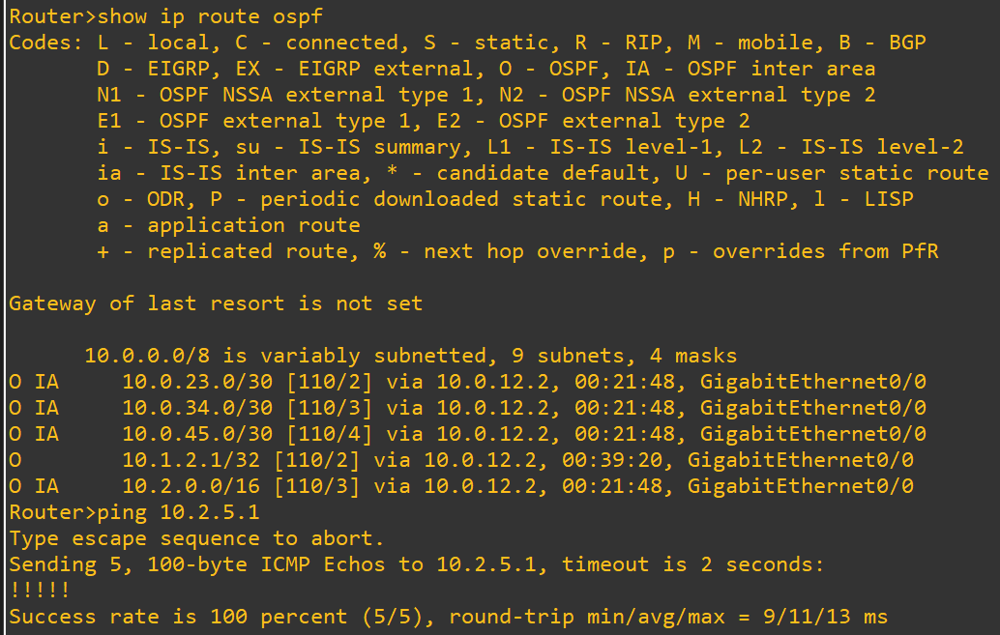

# Test 1: Backbone Failure (Area 0 Dependency)

## Objective

Validate that inter-area communication in OSPF strictly depends on backbone connectivity (Area 0).

---

## Topology Context

* Area 1 → R1, R2
* Area 0 → R2, R3 (Backbone)
* Area 2 → R3, R4, R5

The R2–R3 link forms the backbone connection between Area 1 and Area 2.

---

## 1. Baseline (Before Failure)

### Commands (R1)

```
show ip route ospf
ping 10.2.5.1
```

### Expected

* Inter-area route present:

```
O IA 10.2.0.0/16
```

* Successful connectivity:

```
!!!!! (100%)
```

### Screenshot



---

## 2. Failure Injection

### Action (R2)

```
interface g0/1
shutdown
```

This disables the backbone link between R2 and R3.

### Screenshot



---

## 3. After Failure (Impact)

### Commands (R1)

```
show ip route ospf
ping 10.2.5.1
```

### Observed

* Inter-area route removed:

```
10.2.0.0/16 → missing
```

* Connectivity failure:

```
.....
Success rate = 0%
```

### Screenshot



---

## 4. Root Cause

* OSPF requires all inter-area traffic to traverse Area 0
* Backbone link failure partitions the network
* ABRs cannot exchange LSAs
* Routes are withdrawn from the routing table

---

## 5. Recovery

### Action (R2)

```
interface g0/1
no shutdown
```

### Screenshot



---

## 6. After Recovery (Verification)

### Commands (R1)

```
show ip route ospf
ping 10.2.5.1
```

### Expected

* Route restored:

```
O IA 10.2.0.0/16
```

* Connectivity restored:

```
!!!!! (100%)
```

### Screenshot



---

## Conclusion

* Area 0 is mandatory for inter-area routing
* Loss of backbone connectivity isolates OSPF areas
* OSPF dynamically withdraws and reinstalls routes based on topology state

---

## Tags

`OSPF` `Multi-Area` `Backbone` `Area0` `FailureTesting` `GNS3` `Routing`
    