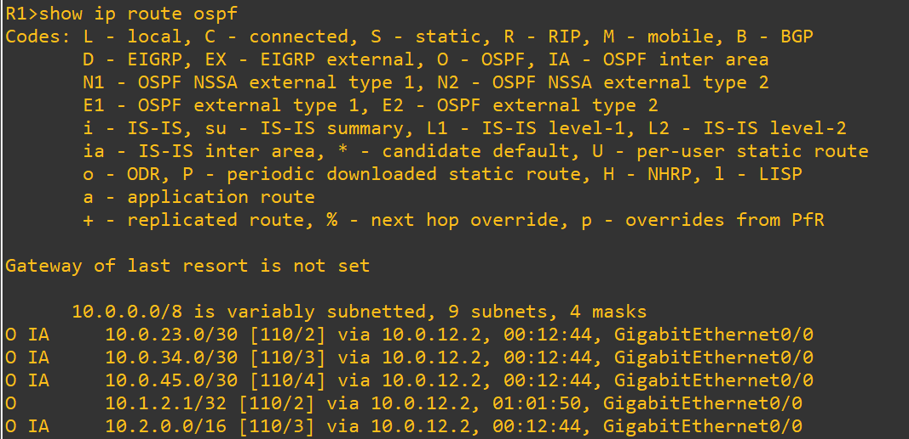
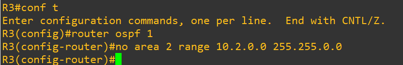
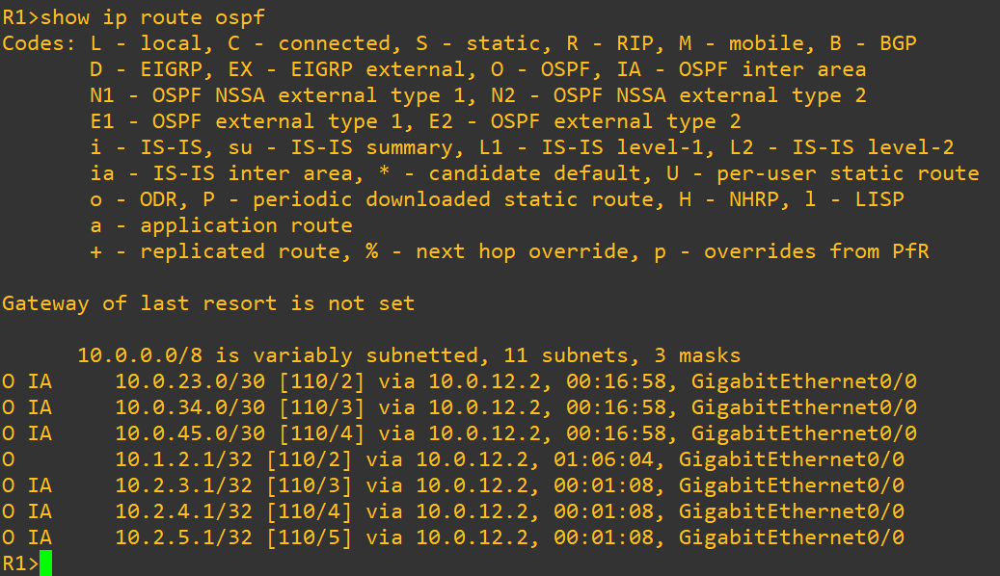
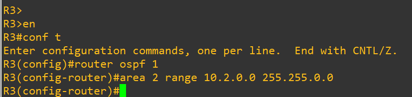
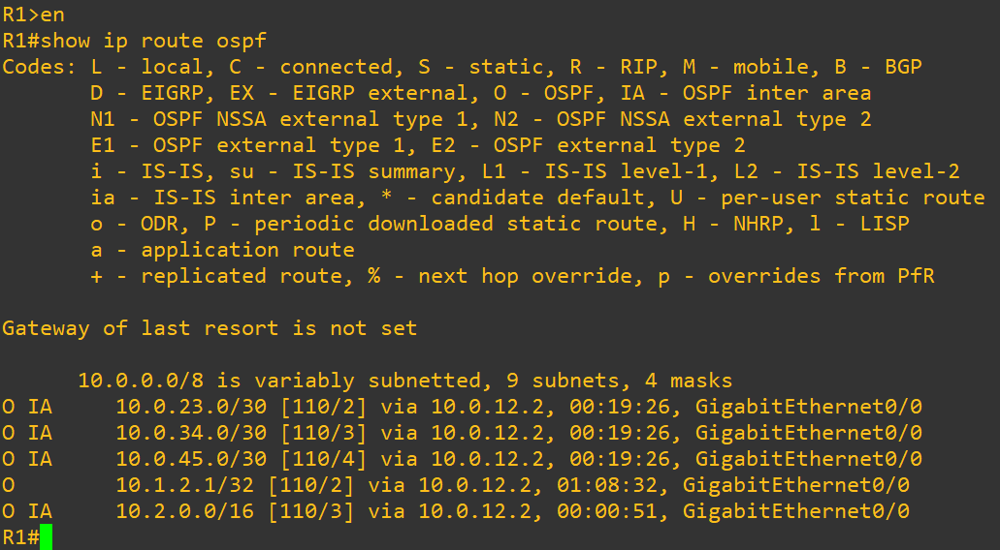

# Test 2: Route Summarization Impact

## Objective

Demonstrate how OSPF route summarization reduces routing table size and improves scalability by comparing summarized vs non-summarized states.

---

## Topology Context

* R2 → ABR (Area 1 ↔ Area 0) → summarizing 10.1.0.0/16
* R3 → ABR (Area 0 ↔ Area 2) → summarizing 10.2.0.0/16

Summarization is configured using:

```
area X range A.B.C.D mask
```

---

## 1. Baseline (Summarization Enabled)

### Commands (R1)

```
show ip route ospf
```

### Expected

* Aggregated routes only:

```
O IA 10.1.0.0/16
O IA 10.2.0.0/16
```

### Screenshot



---

## 2. Failure Injection (Remove Summarization)

### Action (R2)

```
router ospf 1
no area 1 range 10.1.0.0 255.255.0.0
```

### Action (R3)

```
router ospf 1
no area 2 range 10.2.0.0 255.255.0.0
```

### Screenshot



---

## 3. After Break (Route Explosion)

### Commands (R1)

```
show ip route ospf
```

### Observed

* Multiple specific routes instead of summary:

```
10.2.3.1/32
10.2.4.1/32
10.2.5.1/32
```

* Similar expansion for Area 1 routes

### Screenshot



---

## 4. Root Cause

* Without summarization, ABRs advertise every individual network
* Increased number of LSAs
* Larger routing table
* Higher processing overhead

---

## 5. Recovery (Re-enable Summarization)

### Action (R2)

```
router ospf 1
area 1 range 10.1.0.0 255.255.0.0
```

### Action (R3)

```
router ospf 1
area 2 range 10.2.0.0 255.255.0.0
```

### Screenshot



---

## 6. After Recovery (Verification)

### Commands (R1)

```
show ip route ospf
```

### Expected

* Aggregated routes restored:

```
O IA 10.1.0.0/16
O IA 10.2.0.0/16
```

### Screenshot



---

## Conclusion

* Route summarization reduces routing table size
* Limits LSA propagation across areas
* Improves scalability and convergence efficiency
* Essential for large-scale OSPF deployments

---

## Tags

`OSPF` `Summarization` `ABR` `Scalability` `LSA` `Routing` `GNS3`
