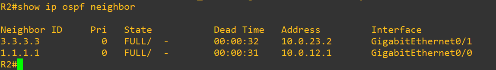
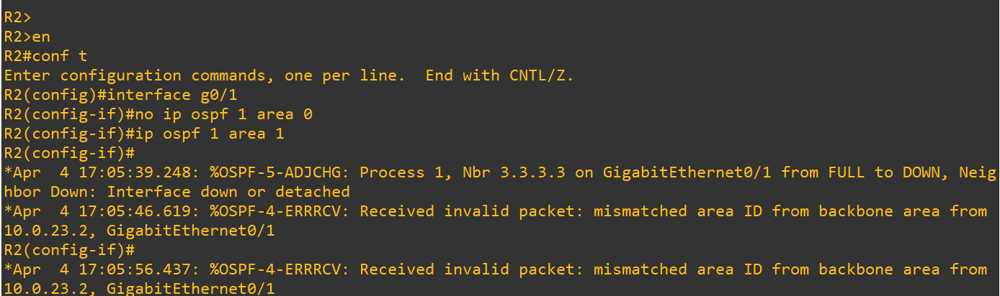
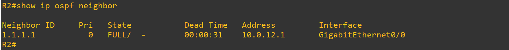
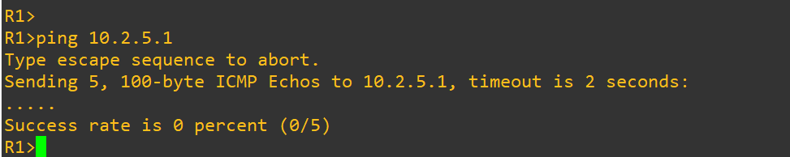
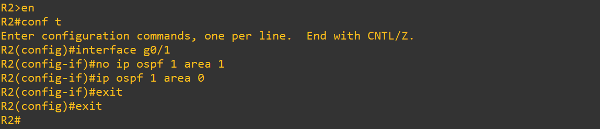
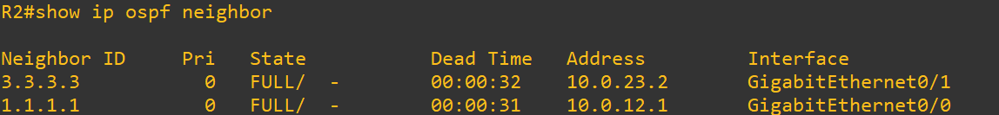

# Test 3: OSPF Adjacency Failure (Area Mismatch)

## Objective

Demonstrate that OSPF neighbors must belong to the same area to form adjacency, and how a mismatch results in immediate neighbor failure.

---

## Topology Context

* R2 ↔ R3 link is part of Area 0 (Backbone)
* This link is critical for inter-area communication

---

## 1. Baseline (Healthy Adjacency)

### Commands (R2)

```id="j4t4tf"
show ip ospf neighbor
```

### Expected

* Neighbor relationship with R3:

```id="17rht7"
State: FULL
```

### Screenshot



---

## 2. Failure Injection (Area Mismatch)

### Action (R2 Interface toward R3)

```id="h9a5dc"
interface g0/1
no ip ospf 1 area 0
ip ospf 1 area 1
```

This introduces an area mismatch between R2 and R3.

### Screenshot



---

## 3. After Break (Adjacency Failure)

### Commands (R2)

```id="4xehse"
show ip ospf neighbor
```

### Observed

* Neighbor R3 missing OR not in FULL state
* Possible log:

```id="g2m0o4"
OSPF-4-ERRRCV: mismatched area ID
```

### Screenshot



---

## Impact Verification

### Commands (R1)

```id="9n0v0j"
ping 10.2.5.1
```

### Observed

* Connectivity failure:

```id="jiv6ke"
.....
Success rate = 0%
```

### Screenshot



---

## 4. Root Cause

* OSPF adjacency requires both routers to be in the same area
* Area mismatch prevents Hello packet acceptance
* No adjacency → no route exchange

---

## 5. Recovery (Correct Area Configuration)

### Action (R2)

```id="4mbo6e"
interface g0/1
no ip ospf 1 area 1
ip ospf 1 area 0
```

### Screenshot



---

## 6. After Recovery (Verification)

### Commands (R2)

```id="h3mlyr"
show ip ospf neighbor
```

### Expected

* Neighbor restored:

```id="ofhgr5"
State: FULL
```

### Screenshot



---

## Conclusion

* OSPF neighbors must share the same area ID
* Area mismatch results in immediate adjacency failure
* This is one of the most common real-world OSPF misconfigurations

---

## Tags

`OSPF` `Adjacency` `AreaMismatch` `Troubleshooting` `Routing` `GNS3`
