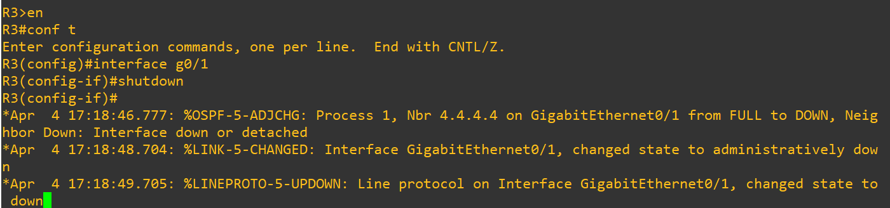
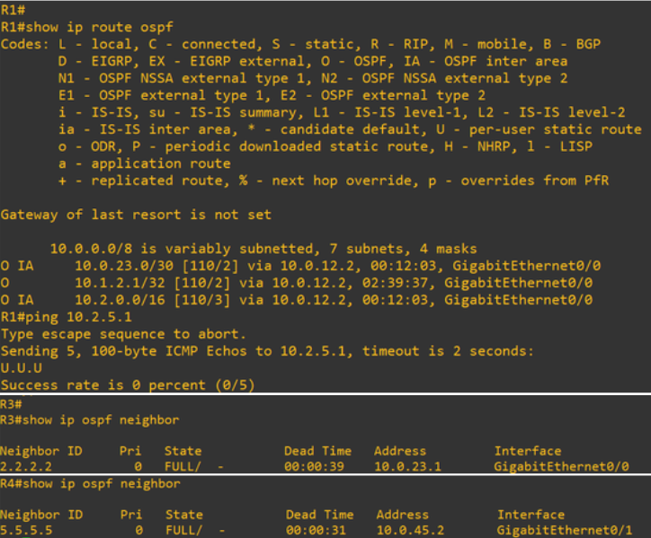
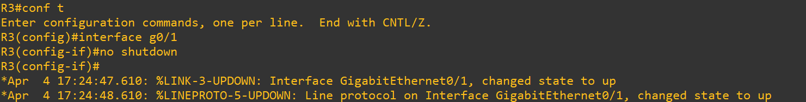
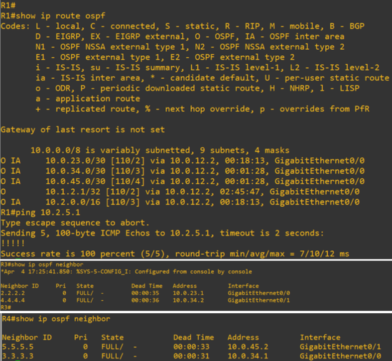

# Test 4: Link Failure Simulation (Physical Outage)

## Objective

Simulate a physical link failure and observe OSPF convergence behavior, including neighbor loss, route withdrawal, and traffic impact.

---

## Topology Context

* Link under test: R3 ↔ R4
* This link connects Area 0 to Area 2
* Failure causes network partition between left and right segments

---

## 1. Baseline (Healthy Network)

### Commands (R1)

```id="0q3e4v"
show ip route ospf
ping 10.2.5.1
```

### Commands (R3 / R4)

```id="7mof7n"
show ip ospf neighbor
```

### Expected

* R1 has route to Area 2:

```id="a9m0g3"
O IA 10.2.0.0/16
```

* Connectivity:

```id="1pkv8j"
!!!!! (100%)
```

* Neighbors:

```id="s8l0bp"
FULL adjacency between R3 and R4
```

### Screenshot


---

## 2. Failure Injection (Simulate Link Down)

### Action (R3)

```id="9m9k6s"
interface g0/1
shutdown
```

This simulates a physical cable failure between R3 and R4.

### Screenshot



---

## 3. After Break (Network Impact)

### Commands (R3 / R4)

```id="4n8pdx"
show ip ospf neighbor
```

### Observed

* R3 no longer sees R4
* R4 no longer sees R3
* Adjacency removed

### Commands (R1)

```id="4qdb4f"
show ip route ospf
ping 10.2.5.1
```

### Observed

* Route to Area 2 removed or reduced
* Connectivity failure:

```id="7x9l8n"
.....
Success rate = 0%
```

### Screenshot



---

## 4. Root Cause

* Physical interface shutdown triggers immediate OSPF neighbor loss
* LSDB is recalculated
* Routes dependent on the failed path are removed
* No alternate path exists → traffic is dropped

---

## 5. Recovery (Restore Link)

### Action (R3)

```id="4z7y4x"
interface g0/1
no shutdown
```

### Screenshot



---

## 6. After Recovery (Convergence)

### Commands (R3 / R4)

```id="6n3s7p"
show ip ospf neighbor
```

### Commands (R1)

```id="z2q7h1"
show ip route ospf
ping 10.2.5.1
```

### Expected

* Neighbor restored:

```id="b8y1t6"
State: FULL
```

* Route restored:

```id="2p1z8o"
O IA 10.2.0.0/16
```

* Connectivity restored:

```id="1v9m4n"
!!!!! (100%)
```

### Screenshot



---

## Conclusion

* OSPF detects link failure through interface state changes
* Adjacency is immediately removed upon link failure
* Routes are dynamically withdrawn and reinstated
* Network convergence restores connectivity after recovery

---

## Tags

`OSPF` `LinkFailure` `Convergence` `Routing` `FailureTesting` `GNS3`
