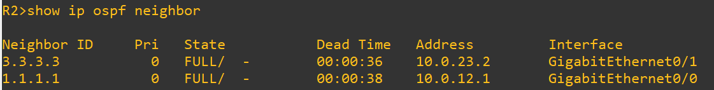
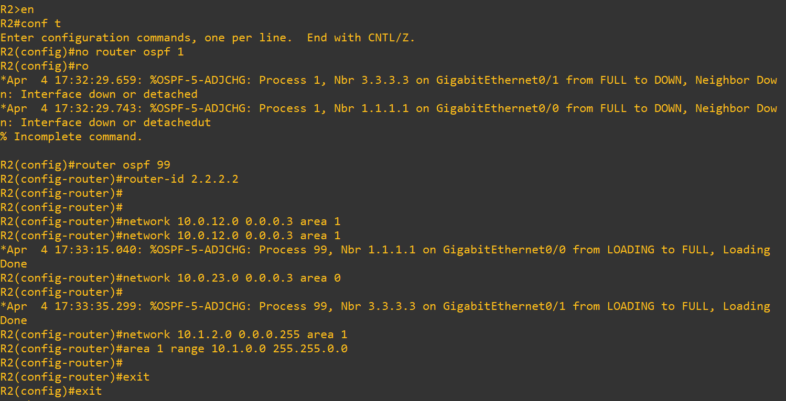
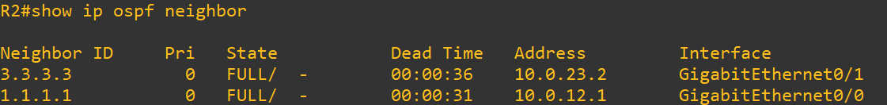

# Test 5: OSPF Process ID (Local Significance)

## Objective
Demonstrate that OSPF process ID is locally significant and does not need to match between neighboring routers for adjacency to form.

---

## Topology Context

- R2 runs OSPF with a different process ID than other routers  
- R2 ↔ R1 and R2 ↔ R3 links remain unchanged  
- Test validates that adjacency is independent of process ID  

---

## 1. Baseline (Matching Process IDs)

### Commands (R2)

show ip ospf neighbor

### Expected

- Neighbors present:

R1 → FULL
R3 → FULL

### Screenshot

---

## 2. Failure Injection (Change Process ID)

### Action (R2)

no router ospf 1

router ospf 99
router-id 2.2.2.2

network 10.0.12.0 0.0.0.3 area 1
network 10.0.23.0 0.0.0.3 area 0
network 10.1.2.0 0.0.0.255 area 1

area 1 range 10.1.0.0 255.255.0.0

This changes the OSPF process ID only on R2.

### Screenshot

---

## 3. After Change (Adjacency Behavior)

### Commands (R2)

show ip ospf neighbor

### Observed

- Temporary neighbor drop may occur  
- Adjacency reforms automatically  
- Final state:

R1 → FULL
R3 → FULL

### Screenshot

---

## 4. Root Cause / Explanation

- OSPF process ID is not exchanged between routers  
- It is locally significant to each device  
- Neighbor relationships depend on:
  - Area ID  
  - Network type  
  - Hello/Dead timers  
  - Subnet matching  

---

## 5. Verification (Post-Convergence)

### Commands (R2)

show ip ospf neighbor

### Expected

- Stable adjacency:

R1 → FULL
R3 → FULL

### Screenshot

---

## Conclusion

- OSPF process ID is locally significant  
- Neighbor routers do not need matching process IDs  
- Adjacency formation is unaffected by process ID differences  
- This is a key concept for troubleshooting and design  

---

## Tags

`OSPF` `ProcessID` `Routing` `Adjacency` `Networking` `GNS3`