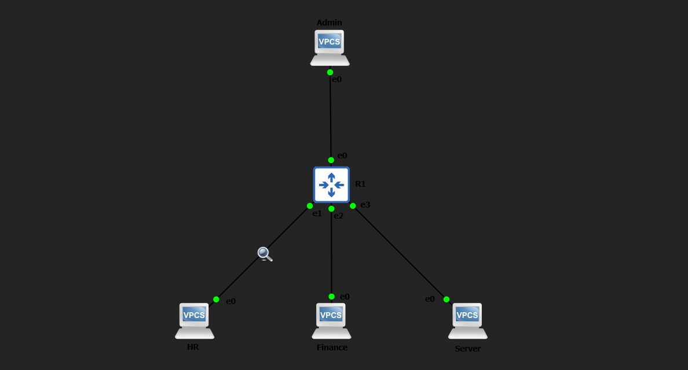

# ACL-Based Network Security Policy Enforcement (GNS3)

## Overview

This project implements **network segmentation and access control using Cisco ACLs** in a multi-subnet environment.

It simulates how real enterprise networks enforce **security policies at the routing layer** — controlling traffic flow, restricting access, and eliminating insecure protocols.

**Designed and validated using structured failure testing to replicate real-world misconfigurations and security failures.**

---

## Architecture

### Network Segments

* **Admin Network** → 10.0.99.0/24
* **HR Network** → 10.0.20.0/24
* **Finance Network** → 10.0.30.0/24
* **Server Network** → 10.0.10.0/24

### Device Role

* **R1** → Core router + policy enforcement point
* All inter-network traffic flows through R1

---

## Design Highlights

* Centralized security enforcement using **Extended ACLs**
* Department-level segmentation (HR ↔ Finance isolation)
* Protocol-level restriction (Telnet blocked globally)
* Secure device access using **SSH + VTY access-class**
* Inbound ACL placement for efficient filtering (closest to source)

---

## Topology

### Physical Topology



---

## IP Addressing

| Network  | Subnet          | Gateway     |
|----------|----------------|-------------|
| Admin    | 10.0.99.0/24   | 10.0.99.1   |
| HR       | 10.0.20.0/24   | 10.0.20.1   |
| Finance  | 10.0.30.0/24   | 10.0.30.1   |
| Server   | 10.0.10.0/24   | 10.0.10.1   |

---

## Security Policies Implemented

### 1. Department Segmentation

* HR is **blocked from accessing Finance**
* Prevents lateral movement between departments

---

### 2. Protocol Restriction

* Telnet (TCP port 23) is **blocked globally**
* Eliminates insecure remote access

---

### 3. Secure Device Access

* Only Admin host (10.0.99.10) can access router via SSH
* Enforced using:
  * Local authentication
  * VTY access-class ACL

---

### 4. Default Allow with Explicit Deny

* Specific traffic is denied
* All other traffic explicitly permitted
* Prevents unintended outages due to implicit deny

---

## Core Concepts Demonstrated

### Access Control Lists (ACLs)

* Extended ACLs for protocol + IP filtering
* Standard ACLs for management plane control

---

### Network Segmentation

* Restrict communication between internal zones
* Reduce attack surface

---

### Control Plane vs Data Plane Security

* Data Plane → Interface ACLs (traffic filtering)
* Control Plane → VTY ACL (device access restriction)

---

### Implicit Deny Behavior

* Every ACL ends with:

deny ip any any

* Missing permit rules lead to complete traffic drop

---

### ACL Placement Strategy

* Extended ACLs applied **closest to source**
* Reduces unnecessary traffic traversal

---

## Failure Testing Methodology

Each test follows a structured validation approach:

```
Baseline → Failure Injection → Impact → Recovery → Verification
```

---

## Failure Scenarios

### 1. ACL Direction Misconfiguration

* Action: Applied ACL outbound instead of inbound
* Result: HR gained access to Finance
* Insight: ACL direction determines enforcement effectiveness

---

### 2. Implicit Deny Misconfiguration

* Action: Removed permit statement
* Result: All HR traffic blocked
* Insight: Implicit deny causes full network outage if not handled

---

### 3. Telnet Block Validation

* Action: Attempted Telnet connection
* Result: Connection dropped
* Insight: Protocol-level filtering eliminates insecure services

---

### 4. SSH Access Misconfiguration

* Action: Allowed HR in SSH ACL
* Result: Unauthorized management access possible
* Insight: Control plane must follow least privilege

---

## Verification Commands

```
show ip access-lists
show running-config | section access-list
show running-config | section vty
show ip interface brief
ping <destination>
```

---

## Key Learnings

* ACL placement is as important as ACL logic
* Implicit deny is the most common source of outages
* Protocol-level filtering is critical for security hardening
* Network segmentation prevents lateral movement
* Control plane security must enforce strict access control
* Misconfigurations can silently bypass security policies

---

## Outcome

This project demonstrates:

* Practical implementation of network security using ACLs
* Ability to enforce and validate security policies
* Strong understanding of traffic flow and filtering logic
* Real-world troubleshooting through failure simulation
* Clear documentation and reproducible testing methodology

---

## Author

Hrishikesh Kanapuram