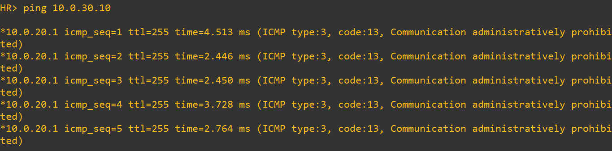
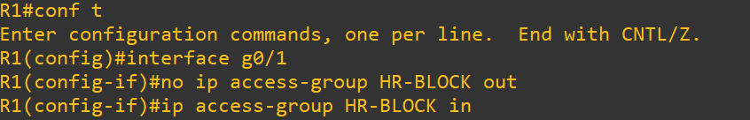
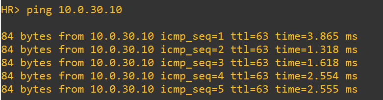
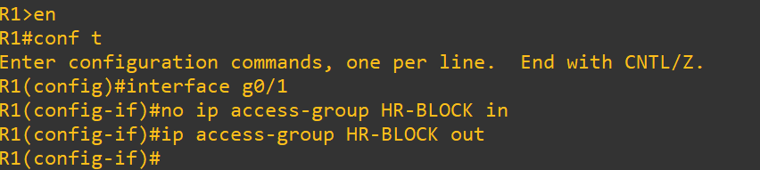
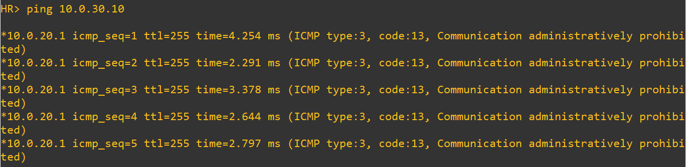

# Test 1: ACL Direction Misconfiguration (IN vs OUT)

## Objective

Validate that ACL placement direction (inbound vs outbound) directly impacts traffic filtering behavior.

---

## Topology Context

* HR Network → 10.0.20.0/24 (G0/1)
* Finance Network → 10.0.30.0/24 (G0/2)
* ACL `HR-BLOCK` applied on R1

Correct design:

* Applied **inbound on HR interface (G0/1)**

---

## 1. Baseline (Before Failure)

### Commands (HR PC)

```
ping 10.0.30.10
```

### Expected

* Traffic blocked by ACL:

```
Communication administratively prohibited
```

### Screenshot



---

## 2. Failure Injection

### Action (R1)

```
interface g0/1
no ip access-group HR-BLOCK in
ip access-group HR-BLOCK out
```

This applies ACL in the wrong direction.

### Screenshot



---

## 3. After Failure (Impact)

### Commands (HR PC)

```
ping 10.0.30.10
```

### Observed

* Traffic now allowed:

```
!!!!! (100%)
```

### Screenshot



---

## 4. Root Cause

* ACL evaluated in the wrong direction
* Filtering occurs after routing decision
* Security policy exists but is not enforced correctly

---

## 5. Recovery

### Action (R1)

```
interface g0/1
no ip access-group HR-BLOCK out
ip access-group HR-BLOCK in
```

### Screenshot



---

## 6. After Recovery (Verification)

### Commands (HR PC)

```
ping 10.0.30.10
```

### Expected

* Traffic blocked again:

```
Communication administratively prohibited
```

### Screenshot



---

## Conclusion

* ACL direction determines enforcement point
* Incorrect placement leads to policy bypass
* Extended ACLs should be applied **closest to source**

---

## Tags

`ACL` `Cisco` `Security` `Segmentation` `Direction` `FailureTesting` `GNS3`
