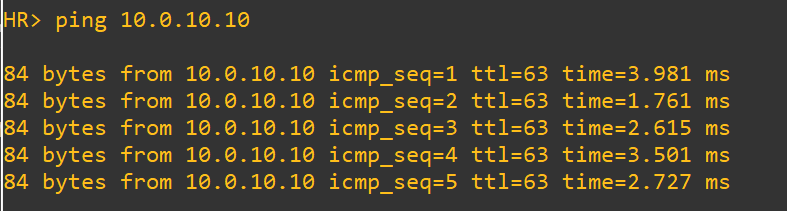
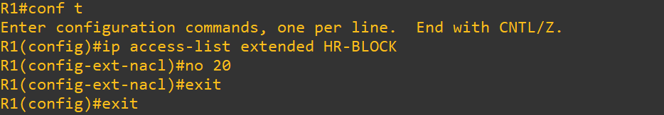
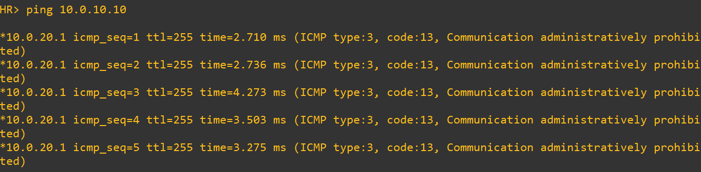
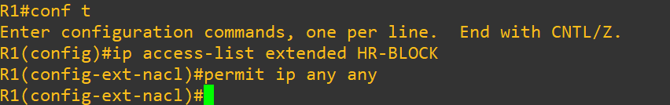
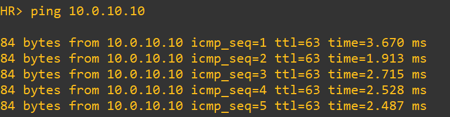

# Test 2: Implicit Deny Behavior

## Objective

Demonstrate that removing the explicit permit statement results in complete traffic blockage due to implicit deny.

---

## Topology Context

* HR Network → 10.0.20.0/24
* Server Network → 10.0.10.0/24
* ACL `HR-BLOCK` controls traffic from HR

---

## 1. Baseline (Before Failure)

### Commands (HR PC)

```
ping 10.0.10.10
```

### Expected

* Successful connectivity:

```
!!!!! (100%)
```

### Screenshot



---

## 2. Failure Injection

### Action (R1)

```
ip access-list extended HR-BLOCK
no permit ip any any
```

### Screenshot



---

## 3. After Failure (Impact)

### Commands (HR PC)

```
ping 10.0.10.10
```

### Observed

* All traffic blocked:

```
.....
Success rate = 0%
```

### Screenshot



---

## 4. Root Cause

* Cisco ACLs end with an implicit:

```
deny ip any any
```

* Without explicit permit:

  * All unmatched traffic is dropped
  * ACL becomes overly restrictive

---

## 5. Recovery

### Action (R1)

```
ip access-list extended HR-BLOCK
permit ip any any
```

### Screenshot



---

## 6. After Recovery (Verification)

### Commands (HR PC)

```
ping 10.0.10.10
```

### Expected

* Connectivity restored:

```
!!!!! (100%)
```

### Screenshot



---

## Conclusion

* Implicit deny is always present in ACLs
* Missing permit statements cause full network outages
* Proper ACL design must explicitly allow required traffic

---

## Tags

`ACL` `ImplicitDeny` `Networking` `Cisco` `Security` `FailureTesting`
