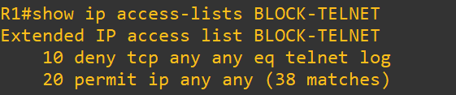
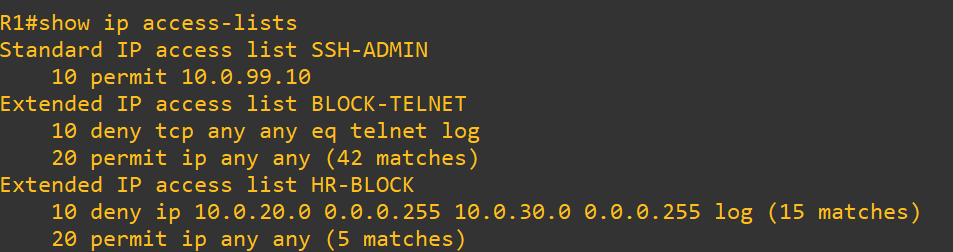

# Test 3: Telnet Protocol Block Enforcement

## Objective

Validate that Telnet (TCP port 23) is globally blocked using extended ACL.

---

## Topology Context

* All networks connected via R1
* ACL `BLOCK-TELNET` applied inbound on all interfaces

---

## 1. Baseline (ACL State)

### Commands (R1)

show ip access-lists BLOCK-TELNET

### Expected

* Telnet explicitly denied:

deny tcp any any eq telnet

### Screenshot

---

## 2. Test Attempt

### Commands (R1)

telnet 10.0.10.10

### Observed

* Connection fails:

Connection timed out

### Screenshot

---

## 3. Verification

### Commands (R1)

show ip access-lists

### Observed

* ACL actively processing traffic:

permit ip any any (hit count increasing)

### Screenshot

---

## 4. Root Cause

* ACL denies TCP port 23 globally
* Telnet traffic dropped at ingress
* No exceptions defined

---

## Conclusion

* Protocol-level filtering prevents insecure services
* Telnet is fully eliminated from network
* ACL enforces secure communication standards

---

## Tags

`ACL` `Telnet` `Security` `ProtocolFiltering` `Cisco` `GNS3`