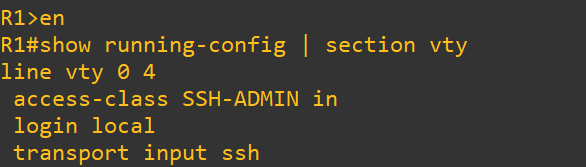
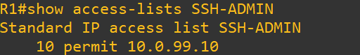
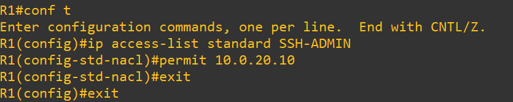
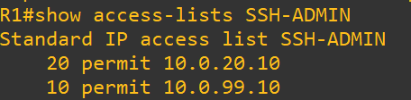
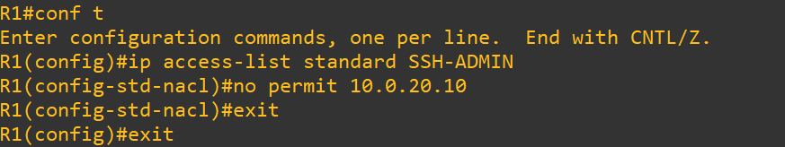
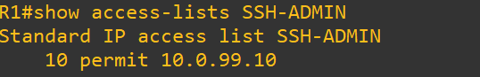

# Test 4: SSH Access Restriction (Control Plane Security)

## Objective

Ensure only the Admin host can access the router via SSH using VTY access-class.

---

## Topology Context

* Admin Host → 10.0.99.10
* All other hosts → HR / Finance / Server networks
* VTY access controlled using `SSH-ADMIN` ACL

---

## 1. Baseline (VTY Configuration)

### Commands (R1)

```
show running-config | section vty
```

### Expected

* SSH only access enforced
* Access-class applied

### Screenshot



---

## 2. ACL Baseline

### Commands (R1)

```
show access-lists SSH-ADMIN
```

### Expected

* Only Admin IP permitted:

```
permit 10.0.99.10
```

### Screenshot



---

## 3. Failure Injection

### Action (R1)

```
ip access-list standard SSH-ADMIN
permit 10.0.20.10
```

### Screenshot



---

## 4. After Failure (Impact)

### Commands (R1)

```
show access-lists SSH-ADMIN
```

### Observed

* Unauthorized host now permitted

### Screenshot



---

## 5. Recovery

### Action (R1)

```
no permit 10.0.20.10
```

### Screenshot



---

## 6. After Recovery (Verification)

### Commands (R1)

```
show access-lists SSH-ADMIN
```

### Expected

* Only Admin host permitted

### Screenshot



---

## Conclusion

* Control plane must follow least privilege principle
* Unauthorized access increases attack surface
* ACL-based restriction ensures secure device management

---

## Tags

`SSH` `VTY` `AccessControl` `Security` `Cisco` `ControlPlane` `GNS3`